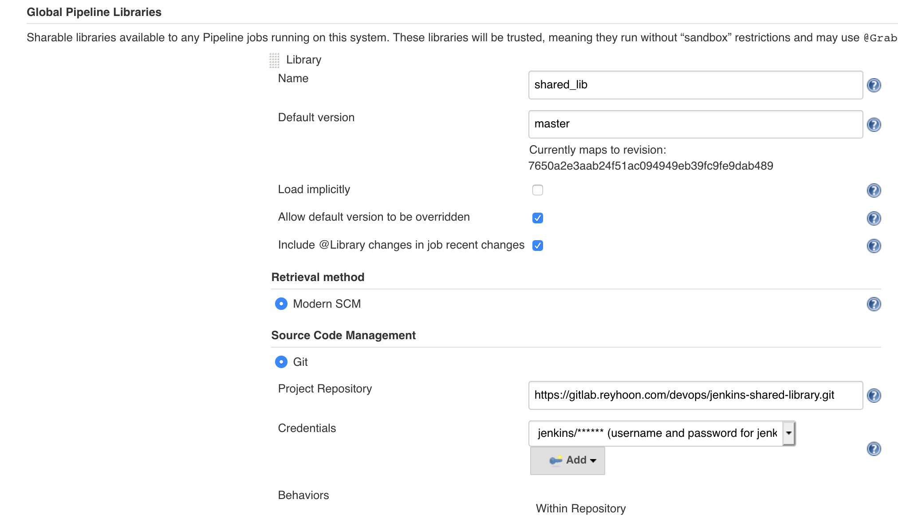
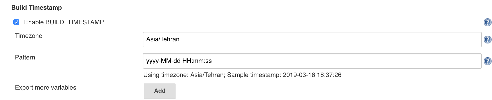

This repository is a Jenkins pipeline to build docker images and push it to harbor ( docker registry )
this pipeline was wrote based docker-compose and  Ansible deployments but you can use it for other deploy methods.


### Requirements
1. Configure VMs first (networks)
2. Installed Gitlab
3. Installed Jenkins
4. Installed Harbor or any docker registry ([harbor](https://github.com/goharbor/harbor))
5. Installed Ansible
6. Envs for Production stage or Development stage

---

Below plugins should Installed on jenkins
1. Gitlab plugin
2. Global Slack Notifier Plugin
3. Publish over ssh
4. Rebuilder
5. SSH pipeline
6. Timestamper

Credentials:
1. harbor Credentials
2. gitlab user and token
3. ssh public key address for ssh to ansible server

---

### How to use:
1. config jenkins shared library


2. Timestamper Config


3. create production.env qa.env (your app env) and docker-compose.yml(docker-compose file of your app) or you should change creating artifact part in pipeline.

4. create Jenkinsfile in your project like this:
```
@Library('shared_lib')_
builder()

```

##### If you use ansible deployment
We need a VM which deliver deployments, It's Necessary to add jenkins public key in ansible server and add ansible user public key
in api servers.
